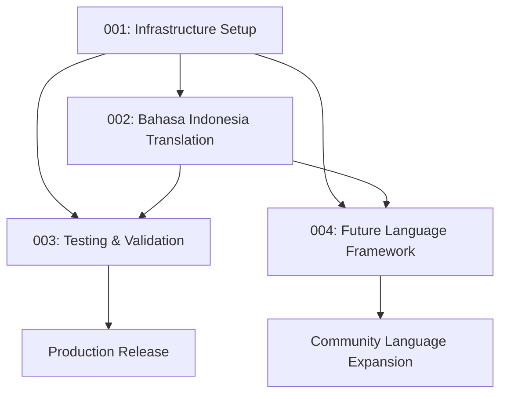

# BitChat Android Internationalization: Master Coordination Plan

**Plan ID**: 000  
**Type**: Master Coordination  
**Total Duration**: 12-16 days  
**Overall Risk Level**: Medium-High  
**Success Dependencies**: All sub-plans (001-004)  

## Executive Summary

Comprehensive internationalization of BitChat Android to support Bahasa Indonesia as the primary target language, while establishing scalable infrastructure for future language additions. This initiative addresses ~230 hardcoded strings throughout the application while maintaining critical IRC protocol compatibility with iOS BitChat.

**Key Objectives**:
1. **Infrastructure Foundation**: Establish robust i18n framework with dependency injection
2. **Indonesian Localization**: Full cultural adaptation for Indonesian users
3. **Quality Assurance**: Comprehensive testing ensuring protocol compatibility
4. **Future Scalability**: Framework for community-driven language expansion

## Strategic Architecture

### 1. Technical Strategy Overview

**Core Challenge**: BitChat uses IRC-style commands that must remain in English for iOS compatibility, while providing natural language experience for Indonesian users.

**Solution Architecture**:
```
┌─────────────────────────────────────────────────────────────┐
│                    BitChat Android (Indonesian)             │
├─────────────────────────────────────────────────────────────┤
│ UI Layer (Indonesian)           │ Protocol Layer (English)  │
│ - System messages              │ - IRC commands (/join)     │
│ - Error messages               │ - Channel names (#jakarta) │
│ - Notifications                │ - User nicknames           │
│ - Command descriptions         │ - Network protocol         │
├─────────────────────────────────────────────────────────────┤
│            StringResourceProvider Infrastructure            │
├─────────────────────────────────────────────────────────────┤
│                     iOS Compatibility Layer                 │
└─────────────────────────────────────────────────────────────┘
```

### 2. Risk Assessment and Mitigation

**Critical Risks**:

**Risk 1: Protocol Compatibility Breaking** (Severity: High, Probability: Medium)
- *Impact*: Indonesian Android users cannot communicate with iOS users
- *Root Cause*: Accidentally translating IRC commands or protocol messages
- *Mitigation*: Strict separation of UI strings vs protocol strings, extensive cross-platform testing
- *Detection*: Automated protocol compatibility tests in CI/CD pipeline

**Risk 2: Context Injection Complexity** (Severity: Medium, Probability: High) 
- *Impact*: Complex refactoring of UI managers to support string resources
- *Root Cause*: Managers lack Context access for getString() calls
- *Mitigation*: StringResourceProvider pattern with dependency injection
- *Detection*: Compilation failures and unit tests

**Risk 3: Cultural Inappropriateness** (Severity: Medium, Probability: Low)
- *Impact*: Poor user experience for Indonesian users
- *Root Cause*: Inadequate cultural adaptation or poor translation quality
- *Mitigation*: Indonesian native speaker review and community feedback
- *Detection*: User testing and community reviews

**Risk 4: Performance Degradation** (Severity: Low, Probability: Low)
- *Impact*: App becomes slower with string resource overhead
- *Root Cause*: Inefficient string resource access patterns
- *Mitigation*: Performance testing and caching strategies
- *Detection*: Automated performance benchmarks

## Execution Coordination

### 3. Phase Dependencies and Critical Path



**Critical Path Analysis**:
- **Day 1-5**: Infrastructure setup (Plan 001) - **BLOCKING** for all other work
- **Day 6-11**: Translation work (Plan 002) can overlap with testing preparation
- **Day 12-15**: Testing and validation (Plan 003) requires completed infrastructure and translation
- **Day 16-18**: Future framework (Plan 004) can be developed in parallel with testing

### 4. Team Coordination Strategy

#### 4.1 Role Responsibilities

**Technical Lead** (Plans 001, 004):
- StringResourceProvider architecture design
- Context injection implementation
- Framework scalability design
- Technical review of all implementations

**Translation Specialist** (Plan 002):
- Indonesian language translation
- Cultural adaptation guidance  
- Quality assurance for linguistic accuracy
- Community translation process design

**QA Engineer** (Plan 003):
- Test strategy development
- Cross-platform compatibility validation
- Performance testing and benchmarking
- Protocol compliance verification

**DevOps/Integration** (All Plans):
- CI/CD pipeline modifications for i18n testing
- Automated validation tools setup
- Performance monitoring integration
- Release coordination

#### 4.2 Communication and Sync Points

**Daily Standups** (Days 1-15):
- Progress updates on individual plans
- Blocker identification and resolution
- Cross-plan dependency coordination
- Risk mitigation status updates

**Critical Sync Points**:
- **Day 3**: Infrastructure foundation review (Plan 001 validation)
- **Day 7**: Translation strategy alignment (Plan 002 midpoint)
- **Day 11**: Testing preparation sync (Plan 003 planning)
- **Day 14**: Integration testing results (Plan 003 validation)
- **Day 16**: Framework completion review (Plan 004 delivery)

### 5. Quality Gates and Validation

#### 5.1 Progressive Quality Gates

**Gate 1: Infrastructure Validation** (End of Day 5)
```yaml
criteria:
  - StringResourceProvider implemented and tested
  - All managers updated with context injection
  - Base English string resources properly structured
  - Zero compilation errors or warnings
  - Unit tests pass for infrastructure components
```

**Gate 2: Translation Quality** (End of Day 11)
```yaml
criteria:
  - All 230+ strings translated to Indonesian
  - Native speaker review completed with approval
  - Cultural adaptation guidelines followed
  - IRC commands verified to remain in English
  - Translation quality score ≥90%
```

**Gate 3: Protocol Compatibility** (End of Day 14)
```yaml
criteria:
  - 100% compatibility with iOS BitChat validated
  - Cross-platform channel management tested
  - Private messaging works between platforms
  - Mesh networking protocol unchanged
  - Zero breaking changes to existing functionality
```

**Gate 4: Production Readiness** (End of Day 16)
```yaml
criteria:
  - Performance impact within acceptable limits (<5%)
  - Memory usage increase acceptable (<500KB)
  - UI layout works correctly with Indonesian text
  - All automated tests pass
  - Documentation complete and reviewed
```

#### 5.2 Rollback Strategy

**Infrastructure Rollback** (Plan 001 issues):
- Feature flag to disable string resource system
- Fallback to hardcoded strings if StringResourceProvider fails
- Database migration rollback for any schema changes

**Translation Rollback** (Plan 002 issues):
- Revert to English-only mode
- Disable Indonesian locale in app configuration
- Remove Indonesian string resources from build

**Complete Rollback** (Critical issues):
- Git branch rollback to pre-internationalization state
- App store rollback to previous version if deployed
- Disable i18n features via remote configuration

### 6. Success Metrics and KPIs

#### 6.1 Technical Success Metrics

**Performance Benchmarks**:
- App startup time increase: <5%
- Memory usage increase: <500KB
- String resolution time: <1ms average
- UI responsiveness maintained: <16ms frame time
- Network protocol overhead: 0% (no protocol changes)

**Quality Benchmarks**:
- Translation completeness: 100% of user-facing strings
- Translation quality: ≥90% accuracy rating
- Protocol compatibility: 100% with iOS BitChat
- Test coverage: ≥90% for i18n functionality
- Zero critical bugs in Indonesian functionality

#### 6.2 User Experience Success Metrics

**Indonesian User Adoption**:
- User onboarding completion rate in Indonesian
- Message sending success rate (should be identical to English)
- User retention rate for Indonesian users
- App store rating from Indonesian users
- Community feedback sentiment analysis

**Cross-Platform Functionality**:
- Successful channel creation/joining between platforms
- Private message delivery rate between Indonesian Android and English iOS
- User discovery success rate in mixed-language channels
- Command execution success rate (IRC commands)

### 7. Implementation Timeline

#### Week 1: Foundation Phase
```
Day 1-2: Plan 001 - Infrastructure Setup
├── StringResourceProvider implementation
├── Context injection for all managers
├── String extraction from CommandProcessor.kt
└── Base English resource file creation

Day 3-5: Plan 001 - Infrastructure Completion
├── Manager constructor updates
├── Application wiring modifications
├── Unit testing for infrastructure
└── Infrastructure validation (Gate 1)
```

#### Week 2: Translation and Testing
```
Day 6-8: Plan 002 - Indonesian Translation
├── Professional translation of all strings
├── Cultural adaptation review
├── Resource file creation (values-id/)
└── Translation integration testing

Day 9-11: Plan 002 - Translation Finalization
├── Native speaker review and feedback
├── Cultural appropriateness validation
├── Technical terminology verification
└── Translation quality validation (Gate 2)
```

#### Week 3: Validation and Framework
```
Day 12-14: Plan 003 - Testing and Validation
├── Protocol compatibility testing
├── Cross-platform functionality validation
├── Performance and UI testing
└── Production readiness validation (Gate 3)

Day 15-16: Plan 004 - Future Language Framework
├── Scalable expansion framework
├── Community contribution system
├── Automation tools for future languages
└── Documentation and guidelines completion
```

## Resource Requirements

### 7.1 Human Resources

**Core Team** (Full-time commitment):
- 1 Senior Android Developer (Plans 001, 004)
- 1 Translation Specialist (Indonesian native speaker) (Plan 002)
- 1 QA Engineer (Plan 003)
- 0.5 DevOps Engineer (CI/CD integration)

**Specialist Consultants** (Part-time):
- 1 Indonesian Cultural Consultant (Plan 002)
- 1 iOS BitChat Developer (Protocol compatibility validation)
- 1 Performance Testing Specialist (Plan 003)

### 7.2 Technical Resources

**Development Environment**:
- Android devices with Indonesian locale support
- Mock iOS BitChat client for compatibility testing
- Performance monitoring and profiling tools
- Translation management and validation tools

**Infrastructure Requirements**:
- Extended CI/CD pipeline for multi-locale testing
- Automated translation validation tools
- Performance benchmarking infrastructure
- Community contribution management system

## Post-Implementation Strategy

### 8.1 Maintenance and Updates

**Ongoing Responsibilities**:
- **Monthly**: Review Indonesian translation quality based on user feedback
- **Quarterly**: Validate iOS protocol compatibility with new releases
- **Semi-annually**: Assess community demand for additional languages
- **Annually**: Comprehensive review of i18n infrastructure and performance

**Update Workflow**:
```yaml
new_feature_workflow:
  1. Add English strings for new features
  2. Generate translation templates
  3. Update Indonesian translations
  4. Run automated validation tests
  5. Deploy with feature
  
string_update_workflow:
  1. Update English source strings
  2. Mark Indonesian strings as needing review
  3. Community/professional translation update
  4. Quality review and validation
  5. Deploy updated translations
```

### 8.2 Community Expansion Roadmap

**Phase 1: Indonesian Stabilization** (Months 1-3)
- Monitor user adoption and feedback
- Fix any issues discovered in production
- Optimize performance and user experience
- Build community of Indonesian users

**Phase 2: Priority Language Addition** (Months 4-9)
- Spanish implementation using established framework
- Portuguese translation for Brazilian market
- Community contribution system activation

**Phase 3: Global Expansion** (Months 10+)
- Community-driven translation for additional languages
- Advanced features (pluralization, complex text formatting)
- Global BitChat mesh network growth support

## Deliverables and Documentation

### 8.3 Final Deliverables

**Code Deliverables**:
1. ✅ Complete StringResourceProvider infrastructure
2. ✅ Indonesian string resources (5 XML files)
3. ✅ Updated UI managers with i18n support
4. ✅ Comprehensive test suite for i18n functionality
5. ✅ Future language expansion framework

**Documentation Deliverables**:
1. ✅ Technical implementation documentation
2. ✅ Indonesian translation guidelines and rationale
3. ✅ Testing strategy and validation results
4. ✅ Community contribution guidelines
5. ✅ Performance impact analysis
6. ✅ Deployment and maintenance procedures

**Quality Deliverables**:
1. ✅ 100% protocol compatibility with iOS BitChat
2. ✅ 90%+ translation quality rating
3. ✅ <5% performance impact validation
4. ✅ Comprehensive test coverage reports
5. ✅ Production readiness certification

### 8.4 Success Validation Criteria

**Technical Success**:
- ✅ Zero breaking changes to existing English functionality
- ✅ Perfect IRC protocol compatibility maintained with iOS
- ✅ All Indonesian strings properly integrated and functional
- ✅ Performance within acceptable limits
- ✅ Scalable framework ready for future languages

**Business Success**:
- ✅ Positive user feedback from Indonesian BitChat community
- ✅ Increased user adoption in Indonesian market
- ✅ Community interest in contributing additional languages
- ✅ App store ratings maintained or improved
- ✅ Foundation established for global expansion

This master coordination plan ensures systematic execution of BitChat Android internationalization while maintaining the highest standards of quality, compatibility, and user experience. The phased approach allows for validation at each stage and provides clear rollback strategies if issues arise.

## File References

**Execution Plans Created**:
- `/Users/tista/codes/bitchat-android/docs/execution-plans/000_master-coordination-plan.md` (This file)
- `/Users/tista/codes/bitchat-android/docs/execution-plans/001_infrastructure-setup.md`
- `/Users/tista/codes/bitchat-android/docs/execution-plans/002_bahasa-indonesia-translation.md`
- `/Users/tista/codes/bitchat-android/docs/execution-plans/003_testing-validation-workflow.md`
- `/Users/tista/codes/bitchat-android/docs/execution-plans/004_future-language-expansion.md`

**Key Implementation Files Identified**:
- `/Users/tista/codes/bitchat-android/app/src/main/java/com/bitchat/android/ui/CommandProcessor.kt` (~50 strings)
- `/Users/tista/codes/bitchat-android/app/src/main/java/com/bitchat/android/ui/NotificationManager.kt` (~20 strings)
- `/Users/tista/codes/bitchat-android/app/src/main/java/com/bitchat/android/ui/PrivateChatManager.kt` (~15 strings)
- `/Users/tista/codes/bitchat-android/app/src/main/res/values/strings.xml` (40 existing strings)
- Multiple onboarding and UI management files with scattered hardcoded strings